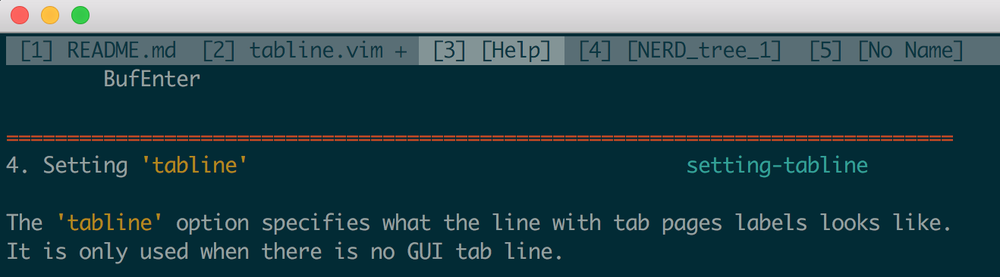

```
           _____________
          < vim-tabline >
           -------------
                  \   ^__^
                   \  (oo)\_______
                      (__)\       )\/\
                          ||----w |
                          ||     ||
```
# vim-tabline
Vim custom tab line with tab number.  
  
See `:h setting-tabline` in vim or visit http://vimdoc.sourceforge.net/htmldoc/tabpage.html#setting-tabline for more informations.
# Installation
Vundle `Plugin 'xuxinx/vim-tabline'`
# Settings
```vim
let g:tabline_show_wins_count = 1 " show windows count, default is disabled
```
